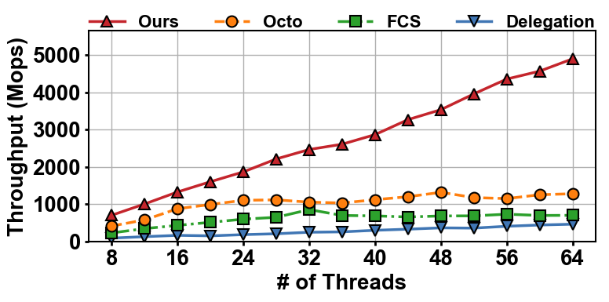

# Less-is-More
## 1 Introduction
This repository provides the implementation of StreamSketch, the first truly scalable parallel sketch framework built on streaming principles:

We applied the framework to five different sketches. The mapping between the code directories and the corresponding sketches is as follows:
|Sketch Directory              | Sketch                                         |
| --------------------- | ---------------------------------------- |
| CM  | Count-Min Sketch                              |
| Count  | Count-Sketch                              |
| UnivMon | UnivMon                  |
| DD          | DDSketch |
| SS  | Spread Sketch                       |

A selection of experimental results is available in the exp_results directory.
## 2 How to run 
### 2.1 Requirements
The following environment is recommended for running the code:
- **Ubuntu 22.04 LTS**
- **CMake ≥ 3.10**
- **g++ ≥ 11.4.0**

Additionally, at least 25 GB of free disk space is required to accommodate a single generated dataset with 3.2e9 keys.
### 2.2 Prepare datasets
In our design, every sketch implementation reads input elements for insertion from a binary file storing 64-bit keys.

A simple binary file containing 64-bit keys can be generated by executing the gen.sh script located in the data_generator directory:
```bash
cd data_generator
sudo chmod +x ./gen.sh
./gen.sh
```
### 2.3 Compile and run  
Modify the value after #define THREAD_NUM in \<sketch_directory\>/config.h to set the desired number of threads.

Use the following commands to compile and run the code:
```bash
cd <sketch_directory>
mkdir build
cd build
cmake ..
make
./<sketch_executable_file> <path_to_dataset>
```

